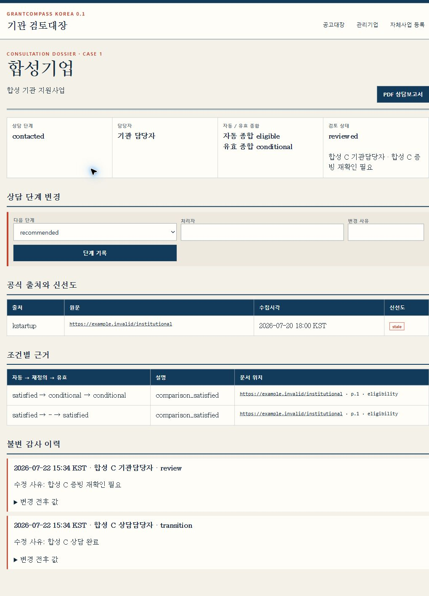

# GrantCompass Korea

GrantCompass Korea 0.1 is an independent, self-hosted tool for matching Korean public
support programs to business facts while retaining official-source and document coordinates.
It provides a founder CLI and a server-rendered institution review workspace.



The screenshot and every distributed demo record are fixture-backed and explicitly synthetic.
They contain no real applicant, representative, institution contact, credential, or private
announcement data.

## Requirements and installation

- Python 3.12 or newer
- A current [uv installation](https://docs.astral.sh/uv/getting-started/installation/)
- SQLite (included with Python)

Install from a downloaded or cloned clean checkout:

```console
cd grantcompass-korea
uv python pin 3.12
uv sync --all-groups
uv run grantcompass --help
```

`uv.lock` is committed. Use `uv lock --check` in CI and do not refresh it incidentally.

## Configuration and API keys

Copy `.env.example` to `.env` and set only local values. The default database is
`sqlite+aiosqlite:///./grantcompass.db`.

```dotenv
GRANTCOMPASS_DATABASE_URL=sqlite+aiosqlite:///./grantcompass.db
GRANTCOMPASS_KSTARTUP_SERVICE_KEY=
GRANTCOMPASS_BIZINFO_SERVICE_KEY=
GRANTCOMPASS_TIMEZONE=Asia/Seoul
```

Request keys through the official pages:

- [K-Startup OpenAPI at 공공데이터포털](https://www.data.go.kr/data/15125364/openapi.do)
- [기업마당 지원사업정보 API](https://www.bizinfo.go.kr/apiDetail.do?id=bizinfoApi)

Never put working keys in commands, Git, screenshots, fixtures, reports, or issue text. Source
request logs redact `serviceKey` and `crtfcKey`, but log files must still be treated as sensitive.

## Database initialization and migrations

For a new local disposable database, create the current schema directly:

```console
uv run grantcompass db init
```

For a maintained installation, use the versioned migrations on a fresh database and before each
upgrade:

```console
uv run alembic upgrade head
```

Do not run the initial migration over a database already created by `db init`; choose one
initialization path. Back up the SQLite file before upgrading an existing installation.

## Founder CLI workflow

Synchronize both supported official sources. `all` is equivalent to the two explicit commands:

```console
uv run grantcompass sources sync --source kstartup
uv run grantcompass sources sync --source bizinfo
# or: uv run grantcompass sources sync --source all
```

Create a profile containing business facts only, then search and write a Markdown report:

```console
uv run grantcompass profile create --name "명백한합성기업-가상1호" \
  --founded-on 2025-01-01 --region 서울 --industry software --json
uv run grantcompass search --profile 1 --json
mkdir reports
uv run grantcompass report --profile 1 --out reports/profile-1.md --json
```

Search JSON includes condition status, stable input errors, source freshness, official URL,
document hash, block ID, and page or section coordinates when evidence exists. Open the official
URL and coordinate before acting on a result. The Markdown report preserves the same evidence and
review gaps; `--force` is required to replace an existing file.

`tests/fixtures/demo/synthetic_companies.json` contains production-schema-validated synthetic
profiles for demos. It is not a bulk-import format and must not be presented as real applicant data.

## Institution web workspace

Run the local workspace bound to loopback unless an authenticated reverse proxy is configured:

```console
uv run uvicorn grantcompass.web.app:create_app --factory --host 127.0.0.1 --port 8000
```

Open `http://127.0.0.1:8000/programs`. The workspace supports source/evidence review, all-company
reverse matching, attributed condition overrides, consultation-stage changes, immutable audit
history, institution-owned PDF/HWPX notice upload, and consultation PDF output. Persisted failure
states are visible at `/programs/failure-scenario`; `/health/failures` returns the same stable IDs
and a `hidden_failures` audit list.

The 0.1 web app has no built-in authentication or role-based access control. Do not expose it to an
untrusted network. Restrict database, report, and uploaded-document access at the host or reverse
proxy.

### PDF runtime and optional OCR

Consultation PDFs require a working WeasyPrint native runtime, not only the Python package. Follow
the official [WeasyPrint installation guide](https://doc.courtbouillon.org/weasyprint/stable/first_steps.html)
for the operating system. A fixed absolute executable can be selected with
`GRANTCOMPASS_WEASYPRINT_EXECUTABLE`. Render timeout, process failure, and invalid PDF output are
hard failures. On the Task 14 Windows QA host, native loading was unavailable because
`libgobject-2.0-0` was missing; PDF runtime QA was therefore not claimed.

Install optional OCR bindings with:

```console
uv sync --all-groups --extra ocr
```

The operating-system Tesseract runtime and an injected OCR provider are still required; 0.1 does
not bundle or automatically configure them. Without one, scan-only PDF pages remain visibly
`ocr_required` and must be reviewed manually.

## Scheduled collection

GrantCompass has no in-process scheduler. On Windows, create a six-hour Task Scheduler job from an
elevated PowerShell prompt, replacing the checkout path:

```powershell
$root = "C:\grantcompass-korea"
$action = New-ScheduledTaskAction `
  -Execute "$root\.venv\Scripts\grantcompass.exe" `
  -Argument "sources sync --source all" `
  -WorkingDirectory $root
$trigger = New-ScheduledTaskTrigger -Once -At (Get-Date).Date.AddHours(1) `
  -RepetitionInterval (New-TimeSpan -Hours 6)
Register-ScheduledTask -TaskName "GrantCompass source sync" -Action $action -Trigger $trigger
```

For cron, use the project directory so `.env` and the relative SQLite path resolve predictably:

```cron
15 */6 * * * cd /srv/grantcompass-korea && mkdir -p var && .venv/bin/grantcompass sources sync --source all >> var/sync.log 2>&1
```

Protect the scheduler account, `.env`, SQLite file, and logs with least-privilege permissions.

## Data sources, limits, and verification

0.1 collects only the official K-Startup announcement API and 기업마당 support-program API.
Contracts and confirmation dates are documented in `docs/sources/`. Source material is external
data, never executable instructions. HWPX and PDF text is parsed as untrusted data; external XML
entities, report resources, redirects at credential-bearing requests, unsafe archive paths, and
unsupported uploads are blocked.

Results are informational aids, not eligibility decisions. Deterministic extraction currently
covers a narrow set of business-age, representative-age, region, and industry wording. Missing,
ambiguous, conflicting, stale, scan-only, or changed evidence requires human review. Always follow
the controlling announcement, attachments, issuing agency guidance, and applicable professional
advice.

Reproduce the release gate:

```console
uv run pytest tests/integration/test_document_benchmark.py -q
uv run pytest tests/integration/test_assessment_benchmark.py -q
uv run pytest -q
uv run basedpyright
uv run ruff check .
uv run ruff format --check .
uv build
```

The committed benchmark corpus contains exactly 30 synthetic document cases and 100 synthetic
assessment cases. See `docs/benchmark/method.md` and `docs/qa/manual-qa.md`.

## Security, contributing, and roadmap

Read [SECURITY.md](SECURITY.md) before handling a vulnerability or suspected data exposure, and
[CONTRIBUTING.md](CONTRIBUTING.md) before changing code or fixtures. This project is independently
implemented from official specifications; see [ADR 0001](docs/decisions/0001-independent-implementation.md).

Post-0.1 work is intentionally separate: NIPA/KOCCA/SMTECH adapters; richer duplicate review;
institution roles, backups, and recovery; a privacy-reviewed hosted demo and institution study;
and legacy binary HWP input. 0.1 supports open HWPX and PDF only.

MIT. See [LICENSE](LICENSE).
